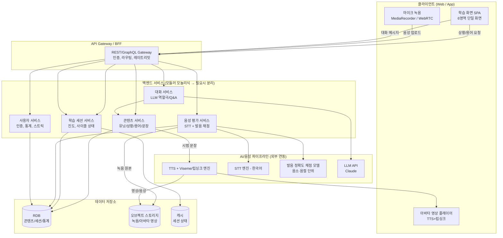
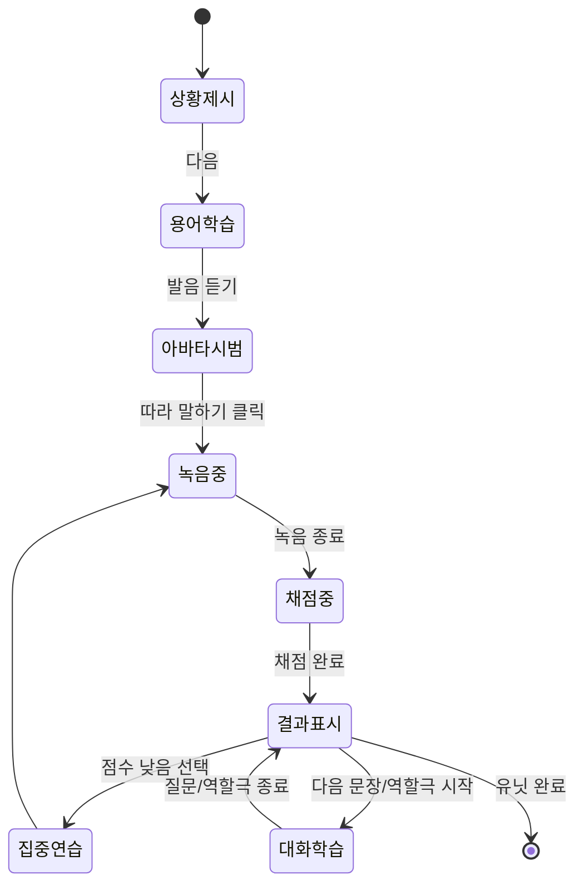
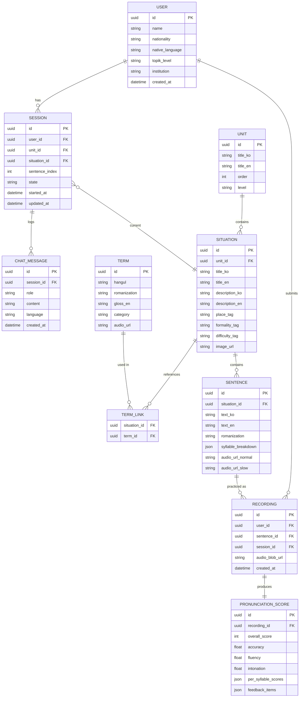

# 한글케어(HangulCare) 프로그램 설계 문서

> 외국인 간호조무 실습생을 위한 AI 한국어 학습 서비스
> 원본: 「의료 용어와 실습 회화를 한 화면에서 배우다」웹페이지 UI 구성 및 프로그램 설계안 (㈜아인픽쳐스, 2026)
> 본 문서는 위 기획안을 웹/앱으로 개발하기 위한 시스템·데이터·API·AI 파이프라인 설계를 정리한다.

---

## 1. 서비스 개요

| 구분 | 내용 |
|---|---|
| 대상 사용자 | 한국 의료기관에서 실습 중인 외국인 간호조무 실습생. TOPIK 초급 수준, 모국어 지원 필요 |
| 학습 내용 | 활력징후·투약·환자 응대 등 실습 상황별 의료 용어와 존댓말 문장. 듣기 → 따라 읽기 → 역할극 순서 |
| 화면 원칙 | 학습·지도·평가를 한 화면(단일 페이지)에 배치, 페이지 이동 없이 한 사이클 완료. 모든 안내는 한국어·영어 병기 |
| 핵심 기능 | 아바타 발음 지도, 발음 정확도 채점, LLM 대화 학습 |

### 화면 6영역 구성 (기획안 기준)

1. **헤더** — 유닛 진도, 언어 전환(KO/EN)
2. **좌측 상단** — 상황(Situation) 설명과 학습 목표
3. **좌측 하단** — 의료 용어 카드 + 따라 읽기(Repeat after me)
4. **우측 상단** — AI 아바타 선생님 (발음 시범, 역할극 상대, 상태 표시)
5. **우측 중단** — 사용자 정보와 학습 통계
6. **하단** — 발음 정확도, AI 피드백, 대화창(LLM 챗)

---

## 2. 전체 시스템 아키텍처



**설계 요지**
- 초기엔 **모듈러 모놀리식**(콘텐츠/세션/음성/대화/사용자를 논리적으로 분리한 단일 백엔드)으로 시작하고, 트래픽이 커지면 음성 평가(SPEECH)·대화(CHAT)처럼 GPU/외부 API 의존이 큰 부분부터 서비스로 분리하는 것을 권장한다.
- TTS/STT/발음채점/LLM은 모두 외부 벤더 API 또는 자체 모델 서빙으로 교체 가능하도록 **인터페이스 뒤에 추상화**한다(벤더 락인 방지).

---

## 3. 프론트엔드 설계

### 3.1 기술 스택

| 영역 | 선택 | 비고 |
|---|---|---|
| 프레임워크 | Next.js (React) + TypeScript | 웹 우선, 추후 React Native로 컴포넌트 로직 일부 재사용 |
| 스타일 | Tailwind CSS | 기획안 톤(다크 그린 #0F2E24 계열 + 오프화이트) 디자인 토큰화 |
| 상태관리 | Zustand (또는 Redux Toolkit) | 세션 진행 상태, 녹음 상태, 대화 히스토리 |
| 오디오 | Web Audio API / MediaRecorder | 녹음, 파형 시각화(하단 발음 정확도 카드) |
| 실시간성 | WebSocket 또는 SSE | 채점 진행 상태, LLM 스트리밍 응답 |
| 다국어 | i18next | 한국어/영어 UI 병기 + 사용자 모국어(추가 언어) 확장 |
| 모바일 | React Native (Expo) | 웹과 동일 상태관리/도메인 로직 패키지 공유 |

### 3.2 컴포넌트 트리 (6영역 매핑)

```
<LessonScreen>                         // 한 화면 = 한 학습 사이클
 ├─ <LessonHeader>                     // 1. 유닛 진도 · 언어 전환
 │   ├─ <UnitProgress current={7} total={12} />
 │   └─ <LanguageToggle value="KO|EN" />
 │
 ├─ <MainGrid>
 │   ├─ <LeftColumn>
 │   │   ├─ <SituationCard>            // 2. 상황 설명·목표
 │   │   │    ├─ image, situationText(ko/en)
 │   │   │    └─ tags: [장소, 존댓말/반말, 난이도]
 │   │   ├─ <KeyTermsGrid>             // 3. 의료 용어 카드
 │   │   │    └─ <TermCard term pronunciation gloss onPlay onListen />[]
 │   │   └─ <RepeatAfterMe>            // 3. 따라 읽기
 │   │        ├─ syllableBreakdown[]   // 음절 단위 표시
 │   │        ├─ <RecordButton />
 │   │        └─ <PlaybackControls slow original />
 │   │
 │   └─ <RightColumn>
 │       ├─ <AvatarTeacher>            // 4. AI 아바타 선생님
 │       │    ├─ <AvatarVideoPlayer state="speaking|listening|idle" />
 │       │    ├─ subtitle(ko/en)
 │       │    └─ actions: [다시 듣기, 입모양 보기, 대화 시작]
 │       └─ <UserStatsPanel>           // 5. 사용자 정보·통계
 │            ├─ profile(name, nationality, level, streak)
 │            └─ stats(totalWords, avgAccuracy, weeklyHours)
 │
 └─ <BottomPanel>
     ├─ <PronunciationScore>           // 6. 발음 정확도
     │    ├─ overallScore, accuracy, fluency, intonation
     │    └─ perSyllableScore[]
     ├─ <AIFeedback>                   // 6. AI 피드백
     │    ├─ feedbackItems[] (경고/성공 카드)
     │    └─ actions: [집중 연습, 다음 문장]
     └─ <ChatPanel>                    // 6. LLM 대화창
          ├─ messages[]
          ├─ quickActions: [예문 더 보기, 역할극 시작]
          └─ <ChatInput placeholder="모국어로 질문 가능" />
```

### 3.3 학습 사이클 상태 머신



- 상태는 `SessionStore`(Zustand)에 보관: `currentUnitId`, `currentSituationId`, `currentSentenceIndex`, `recordingState`, `lastScore`, `chatHistory`.
- 페이지 전환 없이 같은 라우트(`/learn/[unitId]/[situationId]`) 내에서 위 상태 머신만 변경되도록 구현 → 기획안의 "화면 원칙(페이지 이동 없이 한 사이클)"을 충족.

---

## 4. 백엔드 서비스 설계

| 서비스 | 책임 | 주요 의존성 |
|---|---|---|
| **Content Service** | 유닛/상황/용어/예문의 CRUD, 다국어 콘텐츠(ko/en/기타), 난이도·태그 관리 | RDB |
| **Session Service** | 학습 진행 상태, 유닛 잠금/해금, 사이클 상태(상황→용어→따라읽기→대화) | RDB, Cache |
| **Speech Service** | 오디오 업로드 수신 → STT → 발음 채점(정확도/유창성/억양, 음절별 점수) → 피드백 생성 | ASR, 채점 모델, Blob |
| **Chat Service** | LLM 기반 자유 질문 응답, 역할극 대화 오케스트레이션, 컨텍스트(현재 상황·용어) 주입 | LLM API |
| **User Service** | 회원가입/인증(실습기관 소속 정보 포함), 프로필, 통계 집계(총 학습 단어 수, 평균 정확도, 학습 시간), 스트릭 | RDB |
| **Notification/Analytics** (v2) | 학습 리마인더, 기관용 대시보드에 필요한 집계 이벤트 적재 | Event queue |

### 4.1 API 설계 (요약)

```
GET   /api/units                              # 유닛 목록 (진도 포함)
GET   /api/units/:unitId/situations/:situationId
                                               # 상황+용어+예문 번들 (화면 1회 렌더용)
GET   /api/terms/:termId/audio?speed=slow|normal
                                               # 용어 발음 오디오

POST  /api/sessions/:sessionId/recordings     # 녹음 업로드 → 채점 트리거
GET   /api/sessions/:sessionId/recordings/:id/result
                                               # 채점 결과(정확도/유창성/억양/음절별)

POST  /api/chat/:sessionId/messages           # LLM에 메시지 전송 (SSE 스트리밍 응답)
POST  /api/chat/:sessionId/roleplay/start     # 역할극 시작 (환자/보호자/간호사 역할 지정)

GET   /api/users/me                           # 프로필
GET   /api/users/me/stats                     # 학습 통계
PATCH /api/users/me/preferences               # 모국어/UI 언어 설정

GET   /api/avatar/demo?sentenceId=...&speed=  # 아바타 시범 영상(또는 스트림) 조회
```

- 녹음 업로드는 응답을 즉시 주지 않고 `202 Accepted` + `resultUrl`을 반환 → 프론트는 폴링 또는 WebSocket으로 결과 수신(채점에 수 초 소요 가정).
- `/chat` 엔드포인트는 SSE로 토큰 스트리밍하여 "말하는 중" 상태를 UI에 실시간 반영.

---

## 5. 데이터 모델



---

## 6. AI/음성 파이프라인 상세

### 6.1 아바타 발음 시범 (영역 4)
- **방식**: 문장 텍스트 → TTS(한국어 여성 음성, 존댓말 어미 자연스러운 모델) → 오디오의 음소 타임스탬프로 viseme(입모양) 시퀀스 생성 → 사전 제작된 아바타 3D/2D 얼굴 리그에 립싱크 적용.
- **속도 조절**: "느리게 듣기"는 TTS 자체를 저속 합성하거나, 원본 오디오를 타임스트레치(피치 보존)하여 생성 — 실시간성이 필요 없으므로 서버에서 두 버전(normal/slow)을 미리 생성해 캐싱.
- **"입모양 보기"**: 별도 클로즈업 뷰(입 주변 확대) 또는 느린 재생 + 정지 프레임 제공.
- **역할극 상대**: 같은 아바타 파이프라인을 대화 서비스(Chat Service) 응답에 재사용 — LLM이 생성한 응답 문장을 TTS+립싱크로 즉시 변환(스트리밍 시 약간의 지연 허용).

### 6.2 발음 정확도 채점 (영역 6)
- **STT**: 한국어 특화 ASR(예: Whisper 계열 파인튜닝 또는 상용 한국어 STT API)로 사용자 발화를 텍스트/음소 열로 변환.
- **정렬(Forced Alignment)**: 목표 문장과 사용자 발화를 음소 단위로 정렬해 음절별 정확도 산출.
- **3개 지표**:
  - *정확도(Accuracy)*: 음소 단위 발음 정확도(목표 발음과의 유사도).
  - *유창성(Fluency)*: 발화 속도, 불필요한 끊김/머뭇거림.
  - *억양(Intonation)*: 피치 곡선 유사도(존댓말 억양 패턴과 비교).
- **음절별 하이라이트**: 기획안처럼 음절별 점수를 배열로 반환(`per_syllable_scores`)해 프론트에서 색상 하이라이트(예: 61점인 "재"만 강조).
- **피드백 생성**: 규칙 기반(발음 오류 패턴 사전, 예: "ㅐ 모음 → 입을 더 벌리세요") + 점수가 낮은 항목에 한해 LLM으로 자연어 설명을 보강. 이 조합이 응답 속도와 설명 품질의 균형을 맞춘다.
- **참고**: 자체 채점 모델을 처음부터 구축하기보다, MVP 단계에서는 상용 발음평가 API(예: Azure Pronunciation Assessment 등 한국어 지원 여부 확인 필요)를 우선 검토하고, 추후 실습생 발화 데이터가 쌓이면 자체 모델로 전환하는 로드맵을 권장한다.

### 6.3 LLM 대화 학습 (영역 6 대화창 + 역할극)
- **모델**: Claude API.
- **컨텍스트 주입**: 현재 유닛/상황/용어 목록·직전 발음 피드백을 시스템 프롬프트에 포함해 "학습 맥락 안에서만" 답하도록 제한.
- **모국어 질문 지원**: 사용자가 모국어로 질문 → LLM이 사용자의 `native_language` 설정에 맞춰 응답(짧은 설명은 한국어 예문 + 모국어 해설 병기).
- **역할극 모드**: 시스템 프롬프트에 역할(환자/보호자/간호사) 지정 → LLM이 해당 역할로만 대화하며 실습생의 응답 후 자연스러운 다음 턴을 생성. 문장 난이도는 유닛의 `difficulty_tag`에 맞춰 제한.
- **안전장치**: 의료 조언처럼 실제 임상 판단이 필요한 질문에는 "이 앱은 어학 학습용이며 실제 의료 행위는 기관 지침을 따르라"는 안내로 유도하는 가드레일 프롬프트 포함.

---

## 7. 기술 스택 요약

| 계층 | 후보 |
|---|---|
| 웹 프론트엔드 | Next.js + TypeScript + Tailwind + Zustand |
| 모바일 | React Native (Expo), 도메인 로직 공유 패키지 |
| 백엔드 | Node.js(NestJS) 또는 Python(FastAPI) — 음성/AI 파이프라인과의 연동 편의상 Python 후보 우선 고려 |
| DB | PostgreSQL (콘텐츠/세션/통계), Redis(세션 캐시) |
| 스토리지 | S3 호환 오브젝트 스토리지 (녹음 파일, 아바타 영상) |
| 음성 | STT: Whisper 계열 / 상용 한국어 STT API, TTS: 한국어 TTS + viseme 매핑 |
| LLM | Claude API |
| 인프라 | 컨테이너(Docker) + Kubernetes 또는 관리형 컨테이너 서비스, CDN(정적 자산·아바타 영상) |
| 관측성 | 구조적 로깅, 채점/LLM 응답 지연 모니터링, 에러 트래킹 |

---

## 8. 개발 로드맵

| 단계 | 범위 |
|---|---|
| **MVP** | 유닛/상황/용어 콘텐츠 CRUD, 아바타는 사전 녹화 영상(실시간 립싱크 제외), STT 기반 기본 채점(정확도만), 화면 6영역 레이아웃 구현, 한/영 UI 병기 |
| **v2** | 실시간 TTS+립싱크 아바타, 음절별 상세 피드백·집중 연습 루프, LLM 자유 질문 대화 |
| **v3** | 역할극 모드(다중 턴, 역할 전환), 다국어(모국어) 확장, 발음 채점 자체 모델 전환 |
| **v4** | 실습기관/강사용 대시보드(학생 진도·정확도 추이 조회), 오프라인/저속회선 대응 |

## 9. 비기능 요구사항

- **개인정보/데이터**: 음성 녹음은 민감정보로 취급 — 수집 동의, 보관기간 정책, 삭제 요청 처리 절차 필요. 오브젝트 스토리지 접근은 서명된 URL로 제한.
- **성능**: 채점 파이프라인 목표 응답시간(예: 3초 이내), LLM 채팅은 스트리밍으로 체감 지연 최소화.
- **접근성/현지화**: 모든 사용자 노출 텍스트는 ko/en 병기 구조(`_ko`/`_en` 필드)로 콘텐츠 스키마 설계, 추후 다른 모국어 추가 시 컬럼/테이블 확장 용이하게 설계.
- **보안**: 실습기관 소속 인증, 세션 토큰 만료·갱신, 녹음/대화 로그 암호화 저장.

---

## 10. 참고: 프로젝트 폴더 구조 제안 (모노레포)

```
hancare/
├─ apps/
│  ├─ web/                 # Next.js 웹 앱
│  └─ mobile/              # React Native 앱 (v2 이후)
├─ services/
│  ├─ content-service/
│  ├─ session-service/
│  ├─ speech-service/      # STT + 발음채점 + TTS 연동
│  ├─ chat-service/        # LLM 대화/역할극
│  └─ user-service/
├─ packages/
│  ├─ shared-types/        # API 스키마, 도메인 타입 공유
│  └─ ui-kit/              # 6영역 공통 컴포넌트(카드, 버튼 등 디자인 토큰)
└─ docs/
   └─ PROGRAM_DESIGN.md    # 본 문서
```

## 11. 구현 노트 (프론트엔드 프로토타입, 2026)

본 설계를 바탕으로 저장소 루트에 Next.js 기반 **동작하는 프론트엔드 프로토타입**을
구현했다. 실행 방법은 저장소 루트의 `README.md`를 참고. 설계 대비 아래 두 가지는
비용/구현 범위를 고려해 대체했다:

- **LLM 대화(§6.3)**: Claude API 대신 **Gemini API**(`gemini-1.5-flash`)로 연동
  (`app/api/chat/route.ts`). 무료 테스트 티어가 있어 프로토타입 단계의 비용 부담이
  적다. 시스템 프롬프트 주입, 역할극, 모국어 질문 지원 등 설계 의도는 동일하게 유지.
- **PWA(§3.1)**: `next-pwa`/workbox 계열 라이브러리는 이 문서 작성 시점 기준으로
  빌드 도구 체인에 해결되지 않은 취약 의존성(`serialize-javascript` 등)이 남아있어,
  대신 손으로 작성한 최소 서비스워커(`public/sw.js`)를 사용했다. 오프라인 캐싱
  전략이 더 정교하게 필요해지면 그때 workbox 계열 재도입을 검토한다.

그 외 STT/TTS(브라우저 Web Speech API), 발음 채점(텍스트 유사도 근사치),
콘텐츠(로컬 JSON)는 이 문서 §6에서 설명한 실제 파이프라인의 자리표시자이며,
상용 API/자체 모델로 교체 시 `lib/speech.ts`, `lib/scoring.ts`, `lib/content.ts`의
인터페이스만 유지하면 되도록 분리해두었다.

### 로그인 · 진도관리(코스 선택) · 관리자 화면

학습 화면(`/learn/...`) 앞단에 다음을 추가했다:

- **로그인** (`/login`, `lib/auth.ts`): 사용자/관리자 역할을 가진 데모 계정 기반
  클라이언트 인증. §4 User Service의 서버 인증이 준비되기 전까지의 자리표시자이며,
  비밀번호를 코드에 평문으로 둔 방식은 실제 서비스에 절대 그대로 쓰면 안 된다.
- **진도관리(코스 선택)** (`/courses`, `lib/courses.ts`): 학습 화면 진입 전 학습
  단계를 고르는 화면. 요청대로 지금은 기초한글 / 실습한글 / XR실습 3개 대분류만
  잡아두었고, 실습한글만 실제 콘텐츠(§5 데이터 모델의 Unit/Situation)에 연결된다.
  나머지 두 분류의 세부 메뉴·콘텐츠는 추후 확정.
- **관리자 화면** (`/admin`): 학습자 진도 목록을 보여주는 화면. 다중 사용자 백엔드가
  없어 `data/learners.json` 목데이터를 사용하며, §4 User/Session Service 구축 후
  실제 데이터로 교체해야 한다.

라우트 보호는 `components/AuthGuard.tsx`가 클라이언트에서 `localStorage` 인증 상태를
확인하는 방식으로만 이뤄진다(서버 세션 검증 아님) — UX 흐름 검증용이며, 실제 접근
제어는 서버 인증 도입 시 별도로 구현해야 한다.

### 실습내용(콘텐츠) 외부 파일화

기초한글·실습한글 콘텐츠는 `data/`(웹팩 번들에 정적으로 포함되는 위치)가 아니라
저장소 루트의 `content/*.json`에 두고, `lib/content.ts`가 `node:fs/promises`로
**매 요청마다 다시 읽는다**. `/courses`, `/admin`, `/learn/...` 라우트는
`export const dynamic = 'force-dynamic'`로 정적 프리렌더링을 꺼서, 콘텐츠 파일을
바꾸면 재빌드·재배포 없이 다음 요청부터 바로 반영되게 했다(§7 로드맵의 "운영 중
콘텐츠 수시 갱신" 요구사항 대응). 스키마와 편집 방법은 `content/README.md` 참고.
이 방식은 파일시스템에 접근 가능한 자체 호스팅(Node 서버) 전제이며, 향후 §4 Content
Service로 옮겨갈 때는 이 파일들을 그대로 시드 데이터로 재사용할 수 있다.
