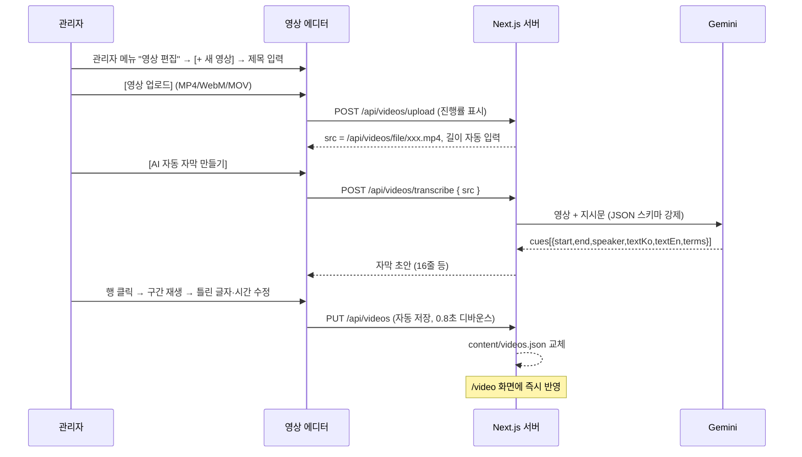

# 영상 에디터 설계 (관리자 "영상 편집" 메뉴)

> 관리자가 학습 영상을 **업로드하면 AI가 자막 초안(대사·시간·영어 뜻·학습 단어)을 만들고, 관리자는 영상을
> 보며 검토·수정만 한 뒤 저장**하는 편집 화면이다. 저장하면 영상학습(`/video`) 화면의 재생·자막·단어 탭·질문
> 기능이 전부 자동으로 동작한다. 관리자 왼쪽 메뉴의 **"영상 편집"**(단어장 편집과 XR실습 편집 사이)으로
> 붙이며, 편집기 본체는 다른 편집기들과 같은 방식의 독립 페이지 `public/hancare-video-editor.html`이다.
> 영상학습 모듈 자체는 [`VIDEO_MODULE_DESIGN.md`](VIDEO_MODULE_DESIGN.md)를 참고.

---

## 1. 배경과 목표

영상학습 화면은 `content/videos.json`의 항목 하나(영상 경로 + 자막 `cues`)만 있으면 재생 컨트롤·자막 동기화·
단어 탭·AI 질문·단어장 연동을 전부 자동으로 만든다. 지금까지는 관리자가 이 JSON을 손으로 써야 했고,
그중 **자막 받아쓰기와 시간 맞추기**가 가장 큰 일이었다.

| 목표 | 방법 |
|---|---|
| 손작업 최소화 | Gemini가 영상을 보고 듣고 자막 초안을 한 번에 생성(음성 + 화면에 박힌 자막 모두 활용) |
| 검토는 쉽게 | 영상 옆에서 행을 누르면 그 구간이 재생되고, "지금 시각" 버튼으로 시작/끝을 찍는다 |
| 바로 반영 | 저장 즉시 `content/videos.json`에 기록 → 학습자 화면은 재배포 없이 다음 요청부터 반영 |
| 기존 도구와 같은 방식 | 다른 편집기(실습내용·단어장·XR실습·역할극)처럼 관리자 왼쪽 메뉴의 독립 편집기로 두고, 같은 디자인·같은 저장 방식 사용 |

---

## 2. 사용 흐름



자동 자막을 쓸 수 없는 환경(서버 없는 `hangulcare.html`, 키 없음)에서는 **SRT/VTT 자막 파일 불러오기** 또는
직접 입력으로 같은 표를 채운다.

---

## 3. 화면 구성

관리자 왼쪽 메뉴: 전체 현황 / 알림 및 면담 / 실습내용 편집 / 단어장 편집 / **영상 편집** / XR실습 편집 / 역할극 편집.
"영상 편집"을 고르면 편집기가 다른 편집기와 같은 3열 레이아웃으로 뜬다(좁은 화면에서는 1열).

```
┌ 영상 편집기 ─ 상태: 저장됨 · 14:02 ──────────────────────────────────┐
│ 툴바: [+ 새 영상] [JSON 불러오기] [JSON 내보내기] [자막 파일(SRT/VTT)]        │
├──────────┬───────────────────────────────────────────┬──────────────────┤
│ 영상 목록  │ ① 기본 정보: ID·제목(한/영)·설명·난이도·관련 학습   │ 학습자 화면 미리보기 │
│ 01 간호조… │ ② 영상 파일: [업로드] 진행률 · 경로 · 길이(자동)   │ (현재 자막, 학습 단어 │
│ 02 식후 …  │    ┌──────── 영상 플레이어 ────────┐           │  밑줄, 영어 뜻)       │
│ ↑↓ ✕      │    └──────────────────────────────┘           │                  │
│           │    [⟲2초] [⟳2초] [현재 시각에 자막 추가]          │ 검사 결과            │
│ [+ 새 영상]│ ③ [AI 자동 자막 만들기] (교체/뒤에 추가)          │ · 끝≤시작 1건        │
│           │ ④ 자막 표                                    │ · 단어가 대사에 없음 1건│
│           │  # │시작│끝│화자│한국어 대사│영어 뜻│학습 단어│▶⤓⤒✕│ 통계: 16줄 · 32단어   │
└──────────┴───────────────────────────────────────────┴──────────────────┘
```

| 영역 | 동작 |
|---|---|
| 영상 목록 | 선택·순서 이동(↑↓)·삭제. 순서가 학습자 목록의 순서(`order`)가 된다 |
| 기본 정보 | `id`는 영문 소문자·숫자·`-`만. 관련 학습은 라이브러리의 상황 목록에서 고르면 `unitId/situationId/labelKo` 자동 입력 |
| 영상 파일 | 업로드 진행률, 파일 교체, 경로 직접 입력(`/videos/x.mp4` 또는 CDN URL). 메타데이터를 읽어 `durationSec` 자동 입력 |
| 플레이어 | 표준 컨트롤 + 2초 앞/뒤, "현재 시각에 자막 추가"(시작=현재, 끝=현재+3초) |
| 자막 표 | 행 클릭 = 그 구간 재생, ⤓ = 시작을 현재 시각으로, ⤒ = 끝을 현재 시각으로, ✕ 삭제. 재생 중인 행 강조 |
| 학습 단어 칸 | `한글=뜻; 한글=뜻` 한 칸 입력(예: `혈압=blood pressure; 재겠습니다=I will measure`) |
| 미리보기 | 재생 위치의 자막을 학습자 화면과 같은 모양(단어 밑줄)으로 표시 |
| 검사 | 끝≤시작, 자막 겹침, 대사 비어 있음, 학습 단어가 대사 안에 글자 그대로 없음, 영상 길이 초과 → 행 빨간 표시 + 목록 |

---

## 4. AI 자동 자막 (Gemini)

- 기존 대화 기능과 같은 `GEMINI_API_KEY`를 쓴다. 모델은 `GEMINI_VIDEO_MODEL`(기본 `gemini-1.5-flash`).
- 영상 18MB 이하는 요청에 직접 담고(inline), 그보다 크면 Gemini File API로 올린 뒤 처리 완료(ACTIVE)를 기다린다.
- `responseMimeType: application/json` + `responseSchema`로 출력 형식을 강제한다.

지시문 요지:
1. 한국 의료기관 실습 중인 외국인 간호조무 실습생(TOPIK 초급)용 학습 자막이다.
2. 들리는 한국어 대사를 **들리는 그대로** 받아쓰고, 화면에 자막이 박혀 있으면 그 표기를 우선한다. 문장 부호·띄어쓰기는 표준에 맞춘다.
3. 한 줄 = 한 문장 또는 의미 단위, 길이 1~7초. 시작·끝은 초 단위 소수 1자리.
4. `speakerKo`는 짧은 역할명(간호조무사, 환자, 보호자, 내레이션 등). 대사가 아닌 화면 문구는 `speakerKo` 없이 넣는다.
5. `textEn`은 자연스러운 영어 번역.
6. `terms`는 줄마다 0~3개, 초급 학습자에게 유용한 단어·표현, **`hangul`은 `textKo` 안에 글자 그대로 있어야 한다.**

서버는 응답을 정리한다: 시간 순 정렬, 0~영상 길이로 자르기, `end ≤ start` 보정, `terms` 중 대사에 없는 것 제거,
id(`<영상id>-1…`) 부여. 결과는 **초안**이며 에디터 표에 "교체" 또는 "뒤에 추가"로 들어간다.

정확도: 시간은 보통 ±0.5~1초 오차가 있어 검토 단계에서 ⤓/⤒로 맞춘다. 비용은 영상 길이에 비례(1분 영상 1회 호출).

---

## 5. 서버 API (Next.js)

| 메서드 | 경로 | 내용 |
|---|---|---|
| GET | `/api/videos` | `content/videos.json` 영상 배열 |
| PUT | `/api/videos` | 영상 배열 전체 저장. 검증(`cleanVideos`) 후 배열 순서대로 `order` 재부여, 임시 파일에 쓰고 교체 |
| POST | `/api/videos/upload?name=원래이름.mp4` | 요청 본문 = 영상 바이트. 확장자 mp4/webm/mov/m4v, 최대 300MB. `uploads/videos/`에 저장(이름 정리·중복 시 번호) → `{ src, size }` |
| GET | `/api/videos/file/:name` | 업로드한 영상 제공. **Range 요청(206) 지원**(탐색·구간 재생에 필요) |
| POST | `/api/videos/transcribe` | `{ src, videoId? }` → Gemini 호출 → `{ cues, durationSec? }` |

- 업로드 파일을 `public/`이 아니라 `uploads/videos/`에 두는 이유: Next.js 운영 서버는 **빌드 시점에 있던 `public` 파일만** 제공한다.
  런타임에 올린 파일은 전용 라우트로 제공해야 한다. `uploads/`는 git에서 제외한다.
- 저장 로직은 기존 편집기들과 같은 `lib/contentStore.ts` 패턴(쓰기 직렬화 + 임시 파일 교체)을 따른다.
- 인증: `middleware.ts`가 세션 쿠키를 확인한다 — 저장·업로드·AI 자동 자막은 관리자만, 영상 파일 보기는 로그인한 사용자만. 업로드·AI 자동 자막에는 사용자별 호출 횟수 제한이 있다([`SECURITY.md`](SECURITY.md)).

---

## 6. 실행 환경별 동작

다른 편집기들과 같은 연결 방식을 따른다(페이지가 `window.HANCARE_VIDEO_CONFIG`를 정한다).

| 환경 | 저장 | 업로드 | AI 자동 자막 |
|---|---|---|---|
| Next.js 앱(`/admin/video-editor`) | `/api/videos` 자동 저장 | 서버에 업로드 | 사용 가능(키 필요) |
| `hangulcare.html` 관리자 "영상 편집"(iframe) | postMessage(`hcVid`)로 부모 창에 전달 → 브라우저 저장소(`hc-videos`)에 보관, 영상학습 화면에 즉시 반영 | 파일은 이 브라우저에서 미리보기만. `src`는 `/videos/파일명`으로 채우고 `public/videos/`에 직접 넣도록 안내 | 불가(서버 없음) → SRT/VTT 불러오기 |
| 파일만 열기(file://) | 저장 안 됨 → JSON 내보내기 | 미리보기만 | 불가 |

---

## 7. 데이터

`content/videos.json` 스키마는 그대로 쓴다([`VIDEO_MODULE_DESIGN.md`](VIDEO_MODULE_DESIGN.md) §5). 에디터가 새로 쓰는 값:

- 업로드 영상의 `src`: `/api/videos/file/<파일명>`
- `order`: 목록 순서(1부터)
- cue `id`: `<영상id>-<번호>` (편집 중 새 행은 고유 번호 부여)

---

## 8. 단계별 계획

| 단계 | 범위 | 상태 |
|---|---|---|
| **1단계** | 관리자 "영상 편집" 메뉴(독립 편집기), 목록·기본 정보·업로드·플레이어·자막 표·검사·미리보기, `/api/videos`·업로드·파일 제공(Range)·Gemini 자동 자막, SRT/VTT 불러오기, JSON 불러오기/내보내기, `hangulcare.html` 연결 | ✅ 이번 구현 |
| 2단계 | ~~관리자 인증~~(✅ [`SECURITY.md`](SECURITY.md)), 업로드 파일 정리(안 쓰는 파일 삭제), 썸네일 자동 추출, 파형 표시로 시간 맞추기, 자막 줄 나누기/합치기 도구 | 예정 |
| 3단계 | 오브젝트 스토리지 + CDN, HLS 변환, 다국어 자막(`textVi` 등) 자동 번역, 퀴즈 자동 생성 | 예정 |
