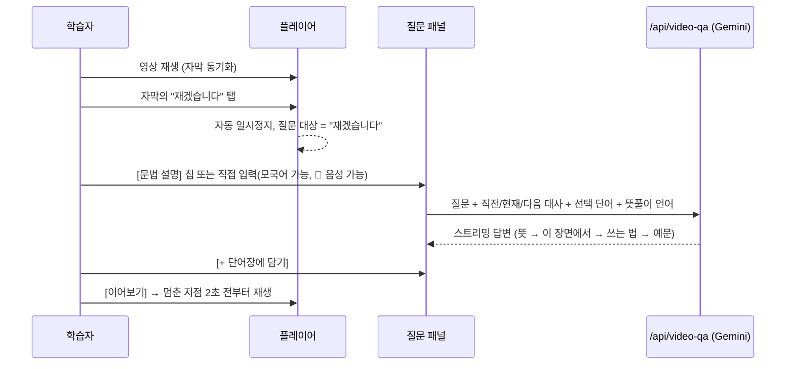
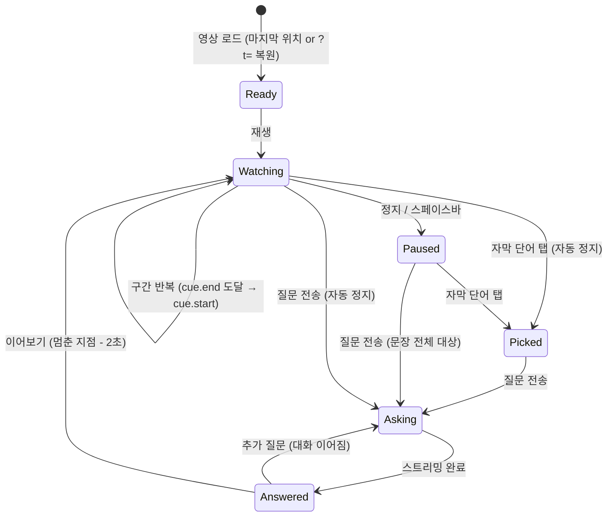

# 영상학습(Video Q&A) 모듈 설계

> 한글케어 학습 보조 자료로 **자체 제작 동영상**을 활용한다. 학습자는 유튜브처럼 영상을
> 보다가 배우고 싶은 단어·표현이 나오면 화면을 멈추고 질문하고, AI 선생님이 **그 장면의
> 대사를 근거로** 뜻·쓰임·확장 예문을 즉시 설명한다. 본 문서는 로그인 후 사이드바
> **영상학습** 메뉴로 실행되는 화면·데이터·상태·AI 프롬프트 구조를 정의한다.
> `docs/PROGRAM_DESIGN.md`(전체 설계), `content/README.md`(콘텐츠 파일 규칙)와 함께 볼 것.

---

## 1. 개요

### 1.1 목표

| 목표 | 설명 |
|---|---|
| 맥락 속 학습 | 단어장처럼 단어만 외우는 게 아니라, 실제 병실 장면의 대사 속에서 표현을 익힌다. |
| 즉시성 | 모르는 표현이 나온 **그 순간** 멈추고 묻는다. 질문 → 설명까지 한 화면, 한두 번의 탭. |
| 확장 | 뜻 풀이에서 끝나지 않고 문법·존댓말 뉘앙스·간호 현장 예문으로 사용법을 넓힌다. |
| 복습 연결 | 질문한 표현을 단어장에 담고, 나중에 단어장에서 그 장면으로 바로 돌아간다. |

### 1.2 사용 시나리오



---

## 2. 앱 통합 지점

- 사이드바(학습자) 메뉴: `XR실습` 다음에 **`영상학습 / Video`** (`components/AppShell.tsx` `learnerNav`)
- 홈 대시보드 히어로에 "영상으로 배우기" 바로가기 (`components/HomeContent.tsx`)
- 라우트

| 경로 | 화면 | 파일 |
|---|---|---|
| `/video` | 영상 목록(사용법 4단계, 시청률·질문 수) | `app/(app)/video/page.tsx` → `components/VideoGrid.tsx` |
| `/video/[videoId]` | 플레이어 + 자막 + 질문 패널 | `app/(app)/video/[videoId]/page.tsx` → `components/VideoLessonScreen.tsx` |
| `/video/[videoId]?t=12` | 특정 장면(12초)부터 열기 — 단어장에서 "장면 보기" | 같은 페이지 |
| `POST /api/video-qa` | 멈춘 장면 기반 질의응답(스트리밍) | `app/api/video-qa/route.ts` |

- 인증: 다른 `(app)` 라우트와 동일하게 `AuthGuard role="any"`.
- 단어장(`/vocab`)에 **"영상에서 담은 표현"** 섹션 추가, 각 항목에서 원래 장면으로 이동.
- `/learn/...` 과의 연결: 영상의 `related` 필드가 있으면 "관련 학습 → 발음 연습" 링크 노출.

---

## 3. 화면 구성

```
데스크톱 (lg ≥ 1024px)                                   모바일
┌──────────────────────────────┬───────────────┐        ┌────────────────┐
│ ← 영상 목록 · 제목 · 설명     │               │        │ 제목            │
├──────────────────────────────┤  멈추고 질문하기 │        │ ① 플레이어       │
│ ① 플레이어 (<video> 16:9)     │  ─────────────  │        │ ② 컨트롤         │
│ ② 컨트롤: 재생/정지 · ⟲5초 ·   │  선택한 표현 칩  │        │ ③ 현재 자막      │
│    이 대사 다시 · 구간반복 ·    │  [+단어장에 담기]│        │ ④ 질문 패널  ←── 자막 바로 아래
│    0.75/1/1.25x · 시간 · 슬라이더│  대화(스트리밍)  │        │ ⑤ 전체 대사      │
│ ③ 현재 자막 (단어 탭 가능, 🔊)  │  [▶ 이어보기]   │        │ 관련 학습 링크    │
│ ⑤ 전체 대사 스크립트           │  빠른 질문 칩    │        └────────────────┘
│ 관련 학습 링크                 │  입력창 🎤 ↑    │
└──────────────────────────────┴───────────────┘
                                 (sticky, 오른쪽 고정)
```

| 영역 | 컴포넌트 | 동작 |
|---|---|---|
| ① 플레이어 | `VideoPlayer.tsx` | HTML5 `<video>`로 자체 MP4 재생. 화면 클릭 = 재생/정지. 파일이 없거나 재생 실패 시 **자막 연습 모드**(§4.3) |
| ② 컨트롤 | `VideoLessonScreen.tsx` | 재생/정지(스페이스바), 5초 뒤로, 현재 대사 처음부터, 구간 반복, 속도 3단계, 위치 슬라이더 |
| ③ 현재 자막 | `CaptionBar.tsx` | 어절·주석 단어 단위 버튼. 주석 단어는 밑줄 강조 + 뜻 툴팁. 탭 → 일시정지 + 질문 대상 지정. 🔊 = 문장 TTS |
| ④ 질문 패널 | `VideoQaPanel.tsx` | 질문 시 자동 일시정지, 질문 시점(⏸ 00:08 · "대사") 표시, 스트리밍 답변, 이어보기, 단어장 담기, 음성 질문 |
| ⑤ 전체 대사 | `TranscriptList.tsx` | 대사 클릭 → 해당 시점 이동. 재생 중 대사 하이라이트·자동 스크롤, "질문함"/"반복" 배지 |

---

## 4. 상호작용 흐름 & 상태

### 4.1 상태 머신



### 4.2 핵심 규칙

- **질문 대상 결정**: 자막 단어를 골랐으면 그 단어, 아니면 멈춘 순간의 대사 문장 전체.
- **대사 매칭**: 현재 시각 이하에서 시작한 마지막 cue를 "현재 대사"로 본다 — 대사 사이
  공백 구간에서 멈춰도 "방금 나온 말"을 질문할 수 있게 하기 위함 (`findCueIndex`).
- **이어보기**: 멈춘 시점 2초 전부터 재생해 문맥을 다시 듣고 넘어가게 한다.
- **위치 저장**: 2초 간격 + 정지 시 `lastPositionSec` 저장, 다음 방문 시 "지난번 본 00:12부터
  이어봅니다" 안내 후 복원.

### 4.3 자막 연습 모드 (영상 파일 대체)

`src`가 비었거나 `<video>`가 `error`를 내면, 같은 컨트롤(재생·정지·탐색·속도·반복)을 가진
**가상 타이머**로 전환해 자막을 시간에 맞춰 크게 띄운다. 영상 촬영 전에도 대본(JSON)만으로
학습·질문 흐름 전체를 운영할 수 있고, 네트워크가 느린 환경의 대체 수단도 된다.

---

## 5. 데이터 스키마 — `content/videos.json`

다른 콘텐츠와 동일하게 **서버가 매 요청마다 다시 읽으므로 재빌드·재배포 없이 수정**된다
(`lib/content.ts`의 `getVideos()` / `getVideo(id)`). 타입은 `lib/types.ts`의
`VideoLesson`, `VideoCue`, `VideoCueTerm`.

```jsonc
[
  {
    "id": "video-bp-check",           // URL(/video/video-bp-check)에 쓰임, 고유
    "order": 1,                        // 목록 정렬 순서
    "titleKo": "아침 활력징후 측정",
    "titleEn": "Morning vital signs check",
    "descriptionKo": "…",
    "src": "/videos/bp-check.mp4",     // public/ 기준 경로 또는 CDN 절대 URL
    "poster": "",                      // 썸네일(선택). 비우면 첫 대사를 카드에 표시
    "durationSec": 36,                 // 목록 표시·자막 연습 모드 길이
    "levelTag": "초급 2",
    "related": { "unitId": "unit-1", "situationId": "situation-1", "labelKo": "혈압·체온 측정" }, // 선택
    "cues": [
      {
        "id": "bp-3",
        "start": 8, "end": 12,         // 초 단위
        "speakerKo": "실습생",          // 선택
        "textKo": "그러면 혈압 좀 재겠습니다.",
        "textEn": "Then I'll take your blood pressure.",
        "terms": [                      // 선택: 강조·툴팁·질문 대상이 되는 어휘 주석
          { "hangul": "혈압", "glossEn": "blood pressure" },
          { "hangul": "재겠습니다", "glossEn": "I will measure" }
        ]
      }
    ]
  }
]
```

- **WebVTT 대신 JSON 자막**을 쓰는 이유: 어휘 주석(`terms`), 화자, 영어 뜻을 한 곳에서
  관리하고 AI 프롬프트에 그대로 넘기기 위해서다. 필요하면 추후 `.vtt → JSON` 변환 스크립트를 둔다.
- `terms[].hangul`은 `textKo` 안에 **글자 그대로** 들어 있어야 강조된다(여러 어절 가능, 예:
  `"올려 주세요"`). 주석이 없는 어절도 탭하면 문장부호를 뺀 어절이 질문 대상이 된다.
- 현재 샘플 2편(활력징후 측정, 식후 투약 안내)은 `practice-hangul.json`의 상황·문장을 대본으로
  확장했다. 영상 파일 자체는 저장소에 없으며 `public/videos/README.md`에 넣는 방법을 안내한다.

---

## 6. AI 프롬프트 설계 — `POST /api/video-qa`

구조는 `/api/chat`과 동일(Gemini `gemini-1.5-flash`, `GEMINI_API_KEY` 없으면 설정 안내 문구
반환, 텍스트 스트리밍). 차이는 **질문 순간의 장면 문맥**을 시스템 프롬프트에 넣는 것이다.

### 요청 바디

| 필드 | 설명 |
|---|---|
| `question` | 학습자 질문(빠른 질문 칩 문구 또는 직접 입력·음성 입력) |
| `history` | 이 영상에서 나눈 이전 Q&A (추가 질문의 맥락) |
| `videoTitleKo` | 영상 제목 |
| `prevCue` / `currentCue` / `nextCue` | 멈춘 시점의 직전·현재·다음 대사(`textKo`, `textEn`, `speakerKo`) |
| `selectedTerm` | 자막에서 고른 단어(없으면 문장 전체 질문) |
| `displayLang` | 설정의 뜻풀이 언어 → 설명 언어를 "쉬운 한국어 + 해당 언어"로 지정 |

### 답변 형식 (시스템 프롬프트로 강제)

1. **뜻** — 기본형과 뜻
2. **이 장면에서** — 대사 속 의미·뉘앙스 (존댓말/겸양 표현이면 반드시 설명: 예 `주무셨어요`, `말씀드릴게요`)
3. **쓰는 법** — 핵심 문법·활용형 1~2개 (예: `-겠습니다` 의지/예고)
4. **예문** — 병원·간호 현장 예문 2~3개(한국어 + 뜻)

규칙: 전체 8줄 이내, 영상·학습 맥락 이탈 금지, **실제 임상 판단 요청은 거절하고 기관 지침을
따르라고 안내**(기존 `/api/chat`과 동일한 안전 규칙).

### 빠른 질문 칩

| 칩 | 단어 선택 시 | 선택 없을 때 |
|---|---|---|
| 뜻 알려줘 | `"혈압" 무슨 뜻이에요? 이 장면에서는 어떤 의미예요?` | `방금 이 문장은 무슨 뜻이에요?` |
| 문법 설명 | `…에 쓰인 문법(어미·존댓말)을 설명해 주세요.` | `이 문장에 쓰인 문법을 설명해 주세요.` |
| 예문 더 보기 | `…을 병원에서 쓰는 예문을 더 알려 주세요.` | `이 문장과 같은 형식으로 … 예문을 더 알려 주세요.` |
| 비슷한 표현 | `…와 비슷한 표현이나 더 공손한 표현을 알려 주세요.` | `이 문장을 다르게 말하는 방법이나 …` |

---

## 7. 진도·단어장·리포트 연동 — `lib/videoStore.ts`

Zustand `persist`(`hangulcare-video`, `safeLocalStorage`) — `lib/xrStore.ts`와 같은 패턴.
실제 백엔드 전까지는 이 브라우저에만 저장된다.

| 상태 | 형태 | 사용처 |
|---|---|---|
| `progress[videoId]` | `{ lastPositionSec, maxPositionSec }` | 이어보기 복원, 목록의 시청률(`maxPositionSec / durationSec`) |
| `questions[videoId]` | `{ cueId, question, at }[]` | 목록의 질문 수, 대사 목록의 "질문함" 배지. 추후 리포트의 "자주 막히는 표현" 분석 원천 |
| `savedTerms` | `{ hangul, glossEn, sentenceKo, videoId, videoTitleKo, cueStart, savedAt }[]` | `/vocab` "영상에서 담은 표현" 섹션, 장면 딥링크(`?t=`) |

리포트(`/report`) 연동은 Phase 2: 영상별 시청 완료율, 질문 수, 질문이 몰린 대사 Top N.

---

## 8. 운영 가이드

- **영상 추가**: ① MP4를 `public/videos/`에 넣고 ② `content/videos.json`에 항목과 `cues`를
  추가 — 재배포 불필요. 권장: H.264+AAC MP4, 720p, 1~3분, 50MB 이하, 한 영상 = 한 상황.
- **자막 타이밍**: 영상 편집 툴에서 대사 시작/끝 시간(초)을 뽑아 `start`/`end`에 적는다.
  Phase 2에서 STT(Whisper 등)로 초벌 자막·타이밍 자동 생성 예정.
- **대용량/다수 영상**: `public/`은 앱과 함께 배포되므로 영상이 늘면 오브젝트 스토리지 +
  CDN으로 옮기고 `src`에 절대 URL을 적는다. 모바일 데이터 절약을 위해 HLS(적응형 비트레이트)
  전환을 권장(`hls.js`, Phase 2).
- **저작권**: 자체 제작 또는 사용 허락을 받은 영상만 사용. 출연자(환자 역 포함) 초상권 동의 필요.
  실제 환자 촬영 금지.
- **비용**: 질문 1회 = Gemini 호출 1회. 같은 장면·같은 단어 질문이 반복되므로 Phase 2에서
  `(videoId, cueId, selectedTerm, 칩 종류)` 키로 답변 캐시 도입 검토.

---

## 9. 구현 로드맵

| 단계 | 범위 | 상태 |
|---|---|---|
| **Phase 1** | `/video` 목록, `/video/[id]` 플레이어(자체 MP4 + 자막 연습 모드), 단어 탭 → 자동 정지 → AI 질문(스트리밍, 음성 입력), 이어보기, 구간 반복·속도, 위치 저장/복원, 단어장 담기·장면 딥링크, 사이드바/홈 진입점 | ✅ 완료 |
| **Phase 2** | 관리자 영상 등록 화면(업로드 + 자막 편집기), STT 자동 자막 생성, 답변 캐시, HLS 스트리밍, 서버 DB에 시청·질문 기록 적재, 리포트 연동, 다국어 자막(`textVi`, `textMn` … 필드 확장) | 예정 |
| **Phase 3** | 쉐도잉: 대사 구간을 따라 말하면 기존 발음 채점(`lib/scoring.ts`, `PronunciationScore`)으로 채점, 질문 기록 기반 복습 퀴즈 자동 생성, 영상 속 장면 역할극(`/roleplay`와 연결) | 예정 |

- 독립 실행형 `hangulcare.html`(GitHub Pages 데모)에는 이번 단계에서 포함하지 않았다.
  Next.js 앱에서 흐름이 확정된 뒤 동일 로직을 이식한다.
