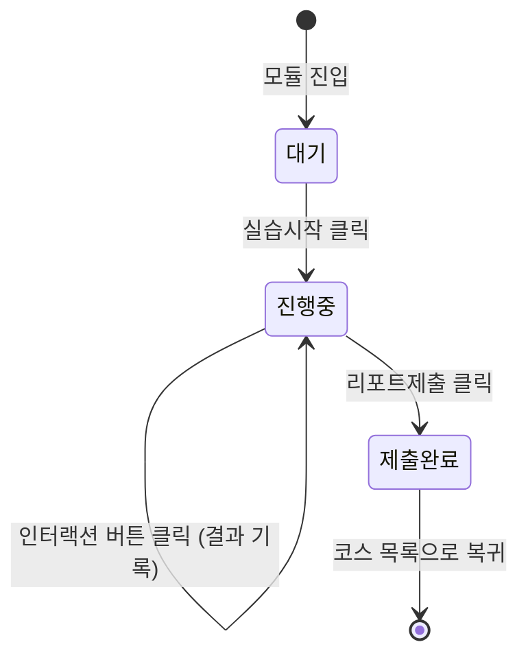

# XR실습(HnaCare XR) 구성 지침

> 원본: 「외국인 간호조무사 현장실습 훈련용 XR콘텐츠 — HnaCare XR」 기술 스펙 PDF
> 본 문서는 로그인 후 대메뉴(진도관리, `/courses`)에서 **XR실습**을 선택했을 때
> 실행되는 화면·데이터·상태 구조를 정의한다. `docs/PROGRAM_DESIGN.md`(전체 서비스
> 설계)와 `content/README.md`(콘텐츠 파일 규칙)를 함께 참고할 것.

---

## 1. 개요

HnaCare XR은 별도 설치 없이 **크롬/엣지 등 표준 브라우저**에서 실행되는 3D 실습
콘텐츠다. PDF 스펙 요지:

- WebGL 2.0 기반 자체 3D viewer, 플러그인 불필요, 저사양 PC 대응
- 입력은 마우스·키보드
- 다국어(한국어/영어/몽골어/베트남어/미얀마어) 번역 지원
- 3D 인터랙션 콘텐츠, 개인별 진도 관리 및 LMS 연동
- Unity 제작 콘텐츠 연동(인터랙션 파트)

### 기술 스택 (PDF 원문)

| 계층 | 스택 |
|---|---|
| 3D Engine & Graphics | Three.js (r160+) / WebGL 2.0, glTF/GLB Draco 파서, Cannon-es 물리 충돌, LOD 최적화, 커스텀 GLSL 셰이더(멸균 영역 표시) |
| Audio & Speech AI | Web Audio API, 3D 공간음향(Spatial Audio), Web Speech API + Whisper 경량 모델(STT), 다국어 Web Speech Synthesis(TTS), Korotkoff 사운드 파형 동기화 |
| App Shell & State | React 18 & TypeScript, Zustand 상태관리, Tailwind CSS, HTML5 Canvas HUD 오버레이, Web Worker 연산 분산 |

**App Shell & State 계층은 한글케어 본 앱과 완전히 동일한 스택**(Next.js/React/TS +
Zustand + Tailwind)이므로, XR실습도 별도 앱이 아니라 **같은 Next.js 프로젝트 안의
라우트**로 통합한다.

---

## 2. 앱 통합 지점 (로그인 → 대메뉴 → XR실습)

```mermaid
graph LR
    A[로그인 /login] --> B[진도관리 대메뉴 /courses]
    B -->|기초한글| C[/learn/...]
    B -->|실습한글| C
    B -->|XR실습| D[XR 모듈 목록 /xr]
    D -->|모듈 선택| E[XR 실습 화면 /xr/:moduleId]
    E -->|리포트 제출| B
```

- `/courses`의 "XR실습" 섹션은 `lib/courses.ts`에서 `content/xr-modules.json`을 읽어
  5대 모듈명·법정 실습시간을 보여주고, 각 항목이 `/xr/${module.id}`로 연결되어
  실제로 열어볼 수 있다(Phase 1 완료 — §7 로드맵 참고).
- `/xr`(모듈 목록)과 `/xr/[moduleId]`(실습 화면)는 다른 라우트와 동일하게
  `AuthGuard role="any"`로 로그인만 확인한다.
- `/xr`, `/xr/[moduleId]`도 다른 라우트와 동일하게 `AuthGuard role="any"`로 로그인
  여부만 확인한다(§4 User Service 서버 인증 붙기 전까지는 프로토타입 수준).

---

## 3. 5대 실습 모듈 (PDF 원문)

| 모듈 | 법정시간 | 핵심 3D 인터랙션 요소 | 적용 기술 |
|---|---|---|---|
| 1. 활력징후 및 기초사정 | 20h | 가상 청진기 상완동맥 접촉, 혈압계 가압/감압 게이지 조작, 자가 혈당 채혈 | Web Audio 오디오 노드, Raycaster 좌표 추적, Canvas 게이지 |
| 2. 무균술 및 상처관리 | 25h | 멸균포 개봉, 핀셋 기구 전달, 멸균 경계면 침범 시 실시간 경고 하이라이트 | GLSL 오버레이 셰이더, Cannon-es 정밀 바운딩 충돌체 |
| 3. 영양 및 배설 보조 | 20h | L-tube 위내 공기 주입음 청취, 도뇨관 고정, 방광 기준 소변백 중력 높이 판정 | Spatial Audio PannerNode, 중력 벡터 판정 알고리즘 |
| 4. 투약 및 기도흡인 | 20h | 인슐린 피하주사 각도(45~90도) 판정, 석션 카테터 회전 발치 시간 측정 | 3D 벡터 각도 연산, 정밀 인터벌 타이머 엔진 |
| 5. 체위변경 및 안전 | 15h | 편마비 환자 지지점 선정, 신체역학 중심점 표시, 휠체어 잠금 브레이크 조작 | Three.js IK(역운동학), 골격 조인트 트래킹 |

이 표는 그대로 `content/xr-modules.json`의 5개 엔트리(`order` 1~5)로 옮겨두었다.
각 모듈은 환자명·상황 대사(`situationKo/En`)와, 해당 모듈의 인터랙션 버튼 목록
(`interactions[]`, 클릭 시 보여줄 결과 문구 포함)을 갖는다.

---

## 4. 화면 UI 구성 (모듈 1 "활력징후 및 기초사정" 기준, PDF p.3 목업 매핑)

```
┌─────────────────────────────────────────────────────────────┐
│ 실습 모듈: 활력징후 및 기초사정                XrModuleHeader   │
├───────────────────────────────────────┬─────────────────────┤
│ ┌───────────────┐                     │  환자정보            │ ← InfoButton
│ │ 인터랙션 결과   │                     │  상황안내(동영상)     │ ← InfoButton
│ │ 모니터(게이지)  │   3D 환자 뷰포트      │  실습시작 (강조)      │ ← StartButton
│ │ SYS/DIA/Pulse  │   (PatientViewport)  │  가상 청진기          │ ┐
│ └───────────────┘                     │  상완동맥접촉         │ │ InteractionButton[]
│                                        │  혈압계 사용          │ │ (실습시작 전 비활성)
│  ⚠ 상황 설명 텍스트(말풍선)             │  혈당 채혈            │ ┘
│  "김진수: 숨이 조금 차고..."   [다음]   │  도움말               │
│                                        │  리포트제출           │
│                                        ├─────────────────────┤
│                                        │ 사용자: 홍길동         │ SessionInfoPanel
│                                        │ 접속시간 / 총실습시간   │
└───────────────────────────────────────┴─────────────────────┘
```

| PDF 라벨 | 컴포넌트(제안) | 동작 |
|---|---|---|
| 현재 진행하는 실습 모듈 제목 | `XrModuleHeader` | 모듈 titleKo/En, 코스 목록 복귀 링크(기존 `LessonHeader`와 동일 패턴) |
| 인터랙션 결과 모니터 | `InteractionMonitor` | 최근 인터랙션 결과를 게이지/텍스트로 표시. 초기엔 빈 상태 |
| 상황 설명 텍스트 + 다음 | `SituationDialogue` | 환자 대사 말풍선 + "다음" 버튼(추후 다중 턴 대사로 확장 가능하도록 배열 스키마 고려) |
| 환자정보 / 상황안내 | `InfoButton` × 2 | 모달 또는 사이드 패널로 환자 정보·상황 안내 영상 표시(영상 자산은 별도 준비 필요) |
| 실습시작 | `StartButton` | 클릭 시 아래 인터랙션 버튼들이 활성화(Zustand `started: true`) |
| 가상 청진기 / 상완동맥접촉 / 혈압계 사용 / 혈당 채혈 | `InteractionButton[]` | `content/xr-modules.json`의 `interactions[]`를 순회 렌더. 클릭 시 결과를 `InteractionMonitor`에 반영 |
| 도움말 | `HelpButton` | 현재 모듈 사용법 안내 |
| 리포트제출 | `SubmitReportButton` | 완료한 인터랙션 결과를 모아 리포트 형태로 요약, 진도관리(관리자 화면)에 반영 |
| 사용자/접속시간/총실습시간 | `SessionInfoPanel` | `lib/auth.ts`의 로그인 계정 + 세션 시작 시각 + 누적 실습시간(모듈별 `legalHours` 대비 진행률로 확장 가능) |

`PatientViewport`(3D 뷰포트) 자리는 실제 3D 에셋이 준비되기 전까지 안내 이미지/설명
placeholder로 대체하고, Phase 2(§7)에서 Three.js 캔버스로 교체한다.

---

## 5. 상태 머신 (Zustand, `lib/xrStore.ts` 예정)



상태 필드(제안):

```ts
interface XrPracticeState {
  started: boolean;
  sessionStartedAt: number | null;         // 접속시간 표시용
  completedInteractions: Record<string, string>; // interactionId -> resultKo
  reportSubmitted: boolean;
}
```

한글케어 학습화면의 `useLessonStore` 패턴(§3.3 상태머신)과 동일한 방식으로,
페이지 이동 없이 한 화면 안에서 상태만 전이시킨다.

---

## 6. 데이터 스키마

```ts
interface XrInteraction {
  id: string;
  labelKo: string; labelEn: string;
  resultKo: string; resultEn: string;  // 실제 3D/물리 연산 대신 프로토타입 단계의 목데이터 결과
}

interface XrModule {
  id: string;
  order: number;
  titleKo: string; titleEn: string;
  legalHours: number;                  // 법정 실습시간
  patientNameKo: string;
  situationKo: string; situationEn: string;
  techNoteKo: string;                  // 적용 기술 스택(표시용)
  interactions: XrInteraction[];
}
```

- 위치: `content/xr-modules.json` (이미 5개 모듈 반영됨)
- 로딩: `lib/content.ts`의 `getXrModules()`/`getXrModule(id)` — 다른 콘텐츠와
  동일하게 **매 요청마다 파일을 새로 읽어** 재배포 없이 갱신된다(`content/README.md`
  참고).
- 진도관리 메뉴 연동: `lib/courses.ts`의 `getCourseSections()`가 이 목록을 읽어
  XR실습 섹션 아이템(모듈명 + 법정시간)을 자동 생성한다.

---

## 7. 구현 로드맵

| 단계 | 범위 | 상태 |
|---|---|---|
| **Phase 0** | 콘텐츠 스키마·진도관리 메뉴 연동(5개 모듈명·법정시간 노출) | ✅ 완료 |
| **Phase 1** | `/xr`, `/xr/[moduleId]` 화면 셸 구현 — §4 UI를 실제 컴포넌트로, 인터랙션 버튼 클릭 시 `content`의 목데이터 결과 표시(3D 없이 텍스트/게이지만) | ✅ 완료 — `components/XrModuleGrid.tsx`, `components/XrPracticeScreen.tsx`, `lib/xrStore.ts`. 독립 HTML 프로토타입(claude.ai 아티팩트)으로 먼저 검증한 뒤 동일 로직을 그대로 이식했다 |
| **Phase 2** | 모듈 1(활력징후)에 실제 Three.js/WebGL 뷰포트 도입 — 절차적 3D 병상·환자 모형 + Raycaster 클릭 히트박스(청진기/상완동맥 등) + Web Audio 합성음(청진음) + Canvas 게이지 | 예정 |
| **Phase 3** | 모듈 2~5에 각 모듈 고유 기술 적용 — GLSL 멸균 경계 셰이더, Cannon-es 충돌, Spatial Audio, IK 골격 트래킹. 실제 3D 에셋(glTF) 제작·튜닝 필요 | 예정(3D 에셋 확보 후) |
| **Phase 4** | Whisper 기반 STT, 다국어 TTS(현재 앱은 ko/en만 지원 — 몽골어/베트남어/미얀마어는 `textXx` 필드 추가로 스키마 확장 가능), LMS 연동(진도 데이터 내보내기), Unity 인터랙션 콘텐츠 임베드 | 예정 |

Phase 2~4는 3D 에셋 제작, 물리 파라미터 튜닝, 실제 STT 모델 서빙 등 이 코드
세션만으로는 끝낼 수 없는 별도 리소스(디자이너/3D 아티스트, GPU 서빙)가 필요하다.
Phase 0~1은 지금 코드베이스 패턴(content 핫리로드, Zustand 상태머신, AuthGuard)
그대로 확장하면 되므로 다음 작업으로 바로 진행 가능하다.

---

## 8. 다국어 / LMS / 진도관리 연동 메모

- **다국어**: 현재 `Lang`은 `'ko' | 'en'`. 몽골어/베트남어/미얀마어 지원 시
  `Situation`/`XrModule`과 동일하게 `textMn`, `textVi`, `textMy` 필드를 추가하고
  `lib/store.ts`의 `Lang` 유니온을 확장하는 방식을 권장(스키마 이미 필드 확장에
  열려 있음).
- **LMS 연동**: `data/learners.json` + `/admin` 화면이 현재는 목데이터이지만,
  실제 LMS 연동 시 `docs/PROGRAM_DESIGN.md` §4 User/Session Service의 API로
  대체하고, XR 모듈의 `completedInteractions`/리포트 데이터를 세션 로그로 적재하면
  된다.
- **진도관리**: `/admin`의 "코스 구성" 카드가 이미 섹션별 콘텐츠 준비 개수를
  집계하므로, XR 모듈이 "available"로 바뀌면 자동으로 반영된다(코드 변경 불필요).
